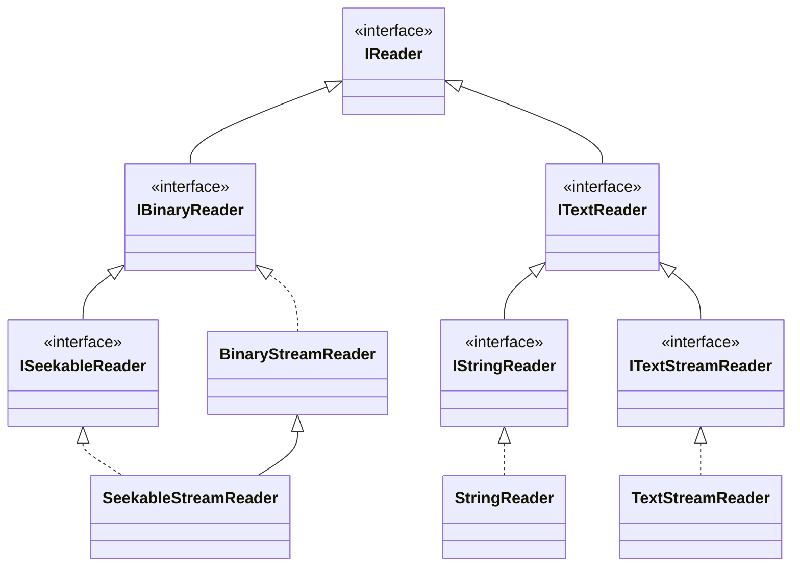

# interface IReader
```csharp
interface IReader
{
	byte ReadByte();
	sbyte ReadSByte();
	bool ReadBool();
	char ReadChar();
	short ReadShort();
	ushort ReadUShort();
	int ReadInt();
	uint ReadUInt();
	long ReadLong();
	ulong ReadULong();
	float ReadFloat();
	double ReadDouble();
	decimal ReadDecimal();
	string ReadString();
}
```
# interface IBinaryReader
```csharp
interface IBinaryReader: IReader
{
	ByteOrder ByteOrder { get; }
	IEnumerable<byte> ReadBytes();
	void ReadBytes(Span<byte> bytes);
	void ReadSBytes(Span<sbyte> sbytes);  
	void ReadBools(Span<bool> bools);
	void ReadChars(Span<char> chars);	
	void ReadShorts(Span<short> shorts);
	void ReadUShorts(Span<ushort> ushorts);
	void ReadInts(Span<int> ints);
	void ReadUInts(Span<uint> uints);
	void ReadLongs(Span<long> longs);
	void ReadUlongs(Span<ulong> ulongs);
	void ReadFloats(Span<float> floats);
	void ReadDoubles(Span<double> doubles);
	void ReadDecimals(Span<decimal> decimals);
}
```
# class BinaryStreamReader
```csharp
class BinaryStreamReader: IBinaryReader, IDestructible
{
	public BinaryStreamReader(Stream srcStream, ByteOrder endianness = ByteOrder.System);
	public ByteOrder ByteOrder { get; set;}
	public bool IsDisposed {get;}
	public IEnumerable<byte> ReadBytes();
	public byte ReadByte();  
	public void ReadBytes(Span<byte> bytes);
	public sbyte ReadSByte();
	public void ReadSBytes(Span<sbyte> sbytes);
	public bool ReadBool();
	public void ReadBools(Span<bool> bools);
	public char ReadChar();
	public void ReadChars(Span<char> chars);
	public short ReadShort();
	public void ReadShorts(Span<short> shorts);
	public ushort ReadUShort();
	public void ReadUShorts(Span<ushort> ushorts);
	public int ReadInt();
	public void ReadInts(Span<int> ints);
	public uint ReadUInt();  
	public void ReadUInts(Span<uint> uints);
	public long ReadLong();
	public void  ReadLongs(Span<long> longs);
	public ulong ReadULong();
	public void ReadULongs(Span<ulong> ulong);
	public float ReadFloat();
	public void ReadFloats(Span<float> floats);
	public double ReadDouble();
	public void ReadDoubles(Span<double> doubles);
	public decimal ReadDecimal();
	public void ReadDecimals(Span<decimal> decimals);    
	public string ReadString();
	public void Dispose();
}
```
## BinaryStreamReader(Stream, ByteOrder)
```csharp
public BinaryStreamReader(Stream srcStream, ByteOrder endianness = ByteOrder.System)
{
  require
  {
    srcStream != null;
    srcStream.CanRead;
    Enum.IsDefined(endianness);
  }
  ensure
  {
    ByteOrder.SameAs(endianness);
  }
}
```
## ByteOrder
```csharp
public ByteOrder ByteOrder
{
  set
  {
    require
    {
      Enum.IsDefined(value);
    }
    ensure
    {
      value.SameAs(ByteOrder);
    }
  }
}
```
## Dispose()
```csharp
public void Dispose()
{
  ensure
  {
    IsDisposed;
  }
}
```
## ReadBool()
```csharp
public bool ReadBool()
{
  throws
  {
    ObjectDisposedException;
    EndOfStreamException;
    IOException;    
  }  
}
```
## ReadBools(Span\<bool>)
```csharp
public void ReadBools(Span<bool> bools)
{
  throws
  {
    ObjectDisposedException;
    EndOfStreamException;
    IOException;    
  }
}
```
## ReadByte()
```csharp
public byte ReadByte()
{
  throws
  {
    ObjectDisposedException;
    EndOfStreamException;
    IOException;    
  }
}
```
## ReadBytes()
```csharp
public IEnumerable<byte> ReadBytes()
{
  throws
  {
    ObjectDisposedException;
    IOException;
  }
}
```
## ReadBytes(Span\<byte>)
```csharp
public void ReadBytes(Span<byte> bytes)
{
  throws
  {
    EndOfStreamException;
    IOException;
    ObjectDisposedException;
  }
}
```
## ReadChar()
```csharp
public char ReadChar()
{
  throws
  {
    ObjectDisposedException;
    EndOfStreamException;
    IOException;   
  }
}
```
## ReadChars(Span\<char>)
```csharp
public void ReadChars(Span<char> chars)
{
  throws
  {
    ObjectDisposedException;
    EndOfStreamException;
    IOException;   
  }
}
```
## ReadDecimal()
```csharp
public decimal ReadDecimal()
{
  throws
  {
    CorruptedStreamException;
    ObjectDisposedException;
    EndOfStreamException;
    IOException;   
  }
}
```
## ReadDecimals(Span\<decimal>)
```csharp
public void ReadDecimals(Span<decimal> decimals)
{
  throws
  {
    CorruptedStreamException;
    ObjectDisposedException;
    EndOfStreamException;
    IOException;   
  }
}
```
## ReadDouble()
```csharp
public double ReadDouble()
{
  throws
  {
    ObjectDisposedException;
    EndOfStreamException;
    IOException;   
  }
}
```
## ReadDoubles(Span\<double>)
```csharp
public void ReadDoubles(Span<double> doubles)
{
  throws
  {
    ObjectDisposedException;
    EndOfStreamException;
    IOException;   
  }
}
```
## ReadFloat()
```csharp
public float ReadFloat()
{
  throws
  {
    ObjectDisposedException;
    EndOfStreamException;
    IOException;   
  }
}
```
## ReadFloats(Span\<float>)
```csharp
public void ReadFloats(Span<float> floats)
{
  throws
  {
    ObjectDisposedException;
    EndOfStreamException;
    IOException;   
  }
}
```
## ReadInt()
```csharp
public int ReadInt()
{
  throws
  {
    ObjectDisposedException;
    EndOfStreamException;
    IOException;   
  }
}
```
## ReadInts(Span\<int>)
```csharp
public void ReadInts(Span<int> ints)
{
  throws
  {
    ObjectDisposedException;
    EndOfStreamException;
    IOException;   
  }
}
```
## ReadLong()
```csharp
public long ReadLong()
{
  throws
  {
    ObjectDisposedException;
    EndOfStreamException;
    IOException;   
  }
}
```
## ReadLongs(Span\<long>)
```csharp
public void ReadLongs(Span<long> longs)
{
  throws
  {
    ObjectDisposedException;
    EndOfStreamException;
    IOException;   
  }
}
```
## ReadSByte()
```csharp
public sbyte ReadSByte()
{
  throws
  {
    ObjectDisposedException;
    EndOfStreamException;
    IOException;    
  }
}
```
## ReadSBytes(Span\<sbyte>)
```csharp
public void ReadSBytes(Span<sbyte> sbytes)
{
  throws
  {
    ObjectDisposedException;
    EndOfStreamException;
    IOException;
  }
}
```
## ReadShort()
```csharp
public short ReadShort()
{
 throws
  {
    ObjectDisposedException;
    EndOfStreamException;
    IOException;
  } 
}
```
## ReadShorts(Span\<short>)
```csharp
public void ReadShorts(Span<short> shorts)
{
  throws
  {
    ObjectDisposedException;
    EndOfStreamException;
    IOException;
  }
}
```
## ReadString()
```csharp
public string ReadString()
{
  throws
  {
    DecoderFallbackException;
    CorruptedStreamException;
    ObjectDisposedException;
    EndOfStreamException;
    IOException;
  }
}
```
## ReadUInt()
```csharp
public uint ReadUInt()
{
  throws
  {
    ObjectDisposedException;
    EndOfStreamException;
    IOException;
  }
}
```
## ReadUInts(Span\<uint>)
```csharp
public void ReadUInts(Span<uint> uints)
{
  throws
  {
    ObjectDisposedException;
    EndOfStreamException;
    IOException;
  }  
}
```
## ReadULong()
```csharp
public ulong ReadULong()
{
  throws
  {
    ObjectDisposedException;
    EndOfStreamException;
    IOException;
  } 
}
```
## ReadULongs(Span\<ulong>)
```csharp
public void ReadULongs(Span<ulong> ulongs)
{
  throws
  {
    ObjectDisposedException;
    EndOfStreamException;
    IOException;
  }
}
```
## ReadUShort()
```csharp
public ushort ReadUShort()
{
  throws
  {
    ObjectDisposedException;
    EndOfStreamException;
    IOException;
  }
}
```
## ReadUShorts(Span\<ushort>)
```csharp
public void ReadUShorts(Span<ushort> ushorts)
{
  throws
  {
    ObjectDisposedException;
    EndOfStreamException;
    IOException;
  }
}
```
# interface ISeekableReader
```csharp
interface ISeekableReader: IBinaryReader
{
	long Position {get; set;}
	long Length {get;}
	bool IsExhausted {get;}
}
```
## Invariant
```csharp
Invariant
{
  Position >= 0; 
  Length >= 0;
  IsExhausted || Position < Length;
}
```
## Position
```csharp
long Position
{
  set
  {
    require
    {
      0 <= value <= Length;
    }
    ensure
    {
      Position == value;
    }
  }
}
```
# class SeekableStreamReader
```csharp
//ver 1
public class SeekableStreamReader: BinaryStreamReader, ISeekableReader
{
  public SeekableStreamReader(Stream stm, ByteOrder endianness = ByteOrder.System);
  public long Position {get; set;}
  public long Length {get;}
  public bool IsExhausted {get;}
}
```
## SeekableStreamReader(Stream, ByteOrder)
```csharp
public SeekableStreamReader(Stream stm, ByteOrder endianness = ByteOrder.System)
{
  require
  {
    stm != null;
    stm.CanRead;
    stm.CanSeek;
    Enum.IsDefined(endianness);
  }
  ensure
  {
    Position == stm.Position;
    Length == stm.Length;
    ByteOrder.SameAs(endianness);
  }
}
```
# interface ITextReader
```csharp
interface ITextReader: IReader
{
	bool TryReadByte(out byte b, NumeralSystem radix = default);
	bool TryReadSByte(out sbyte sb, NumeralSystem radix = default);
	bool TryReadBool(out bool b, NumeralSystem radix = default);
	bool TryReadChar(out char c);
	bool TryReadShort(out short s, NumeralSystem radix = default);
	bool TryReadUShort(out ushort us, NumeralSystem radix = default);
	bool TryReadInt(out int n, NumeralSystem radix = default);
	bool TryReadUInt(out uint ui, NumeralSystem radix = default);
	bool TryReadLong(out long l, NumeralSystem radix = default);
	bool TryReadULong(out ulong ul, NumeralSystem radix = default);
	bool TryReadFloat(out float f, NumeralSystem radix = default);
	bool TryReadDouble(out double d, NumeralSystem radix = default);
	bool TryReadDecimal(out decimal d, NumeralSystem radix = default);
	bool TryReadString(out string s);
	bool TryReadRune(out string r);
	string? ReadLine();
}
```