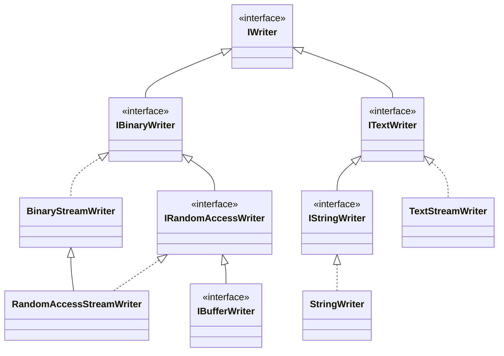

# interface IWriter
```csharp
//ver 1
public interface IWriter
{
  void WriteByte(byte b);
  void WriteSByte(sbyte sb);
  void WriteBool(bool b);
  void WriteChar(char c);
  void WriteShort(short s);
  void WriteUShort(ushort us);
  void WriteInt(int i);
  void WriteUInt(uint ui);
  void WriteLong(long l);
  void WriteULong(ulong ul);
  void WriteFloat(float f);
  void WriteDouble(double d);
  void WriteDecimal(decimal d);
  void WriteString(string str);
}
```
## WriteString(string)
```csharp
void WriteString(string str)
{
  require
  {
    str != null;
  }
}
```
# IBinaryWriter
```csharp
//ver 1
public interface IBinaryWriter : IWriter
{
  ByteOrder ByteOrder { get; }
  void WriteBytes(ReadOnlySpan<byte> bytes);
  void WriteSBytes(ReadOnlySpan<sbyte> sbytes);
  void WriteBools(ReadOnlySpan<bool> bools);
  void WriteChars(ReadOnlySpan<char> chars);
  void WriteShorts(ReadOnlySpan<short> shorts);
  void WriteUShorts(ReadOnlySpan<ushort> ushorts);
  void WriteInts(ReadOnlySpan<int> ints);
  void WriteUInts(ReadOnlySpan<uint> uints);
  void WriteLongs(ReadOnlySpan<long> longs);
  void WriteULongs(ReadOnlySpan<ulong> ulongs);
  void WriteFloats(ReadOnlySpan<float> floats);
  void WriteDoubles(ReadOnlySpan<double> doubles);
  void WriteDecimals(ReadOnlySpan<decimal> decimals);
}
```
# class BinaryStreamWriter
```csharp
//ver 1
public class BinaryStreamWriter: IBinaryWriter, IDestructible
{
  public BinaryStreamWriter(Stream destStream, ByteOrder endianness = ByteOrder.System)
  public ByteOrder ByteOrder { get; set; }
  public bool IsDisposed {get;}
  public void WriteByte(byte b);
  public void WriteBytes(ReadOnlySpan<byte> bytes);
  public void WriteSByte(sbyte sb);
  public void WriteSBytes(ReadOnlySpan<sbyte> sbytes);
  public void WriteBool(bool b);
  public void WriteBools(ReadOnlySpan<bool> bools);
  public void WriteChar(char c);
  public void WriteChars(ReadOnlySpan<char> chars);
  public void WriteShort(short s);
  public void WriteShorts(ReadOnlySpan<short> shorts);
  public void WriteUShort(ushort us);
  public void WriteUShorts(ReadOnlySpan<ushort> ushorts);
  public void WriteInt(int i);
  public void WriteInts(ReadOnlySpan<int> ints);
  public void WriteUInt(uint ui);
  public void WriteUInts(ReadOnlySpan<uint> uints);
  public void WriteLong(long l);
  public void WriteLongs(ReadOnlySpan<long> longs);
  public void WriteULong(ulong ul);
  public void WriteULongs(ReadOnlySpan<ulong> ulongs);
  public void WriteFloat(float f);
  public void WriteFloats(ReadOnlySpan<float> floats);
  public void WriteDouble(double d);
  public void WriteDoubles(ReadOnlySpan<double> doubles);
  public void WriteDecimal(decimal d);
  public void WriteDecimals(ReadOnlySpan<decimal> decimals);
  public void WriteString(string s);
  public void Dispose();
}
```
## BinaryStreamWriter(Stream, ByteOrder)
```csharp
public BinaryStreamWriter(Stream destStream, ByteOrder endianness = ByteOrder.System)
{
  require
  {
    destStream != null;
    destStream.CanWrite;
    Enum.IsDefined(endianness);
  }
  ensure
  {
    ByteOrder.SameAs(endianness);
  }
}
```
## ByteOrder
```csharp
public ByteOrder ByteOrder
{
  set
  {
    require
    {
      Enum.IsDefined(value);
    }
    ensure
    {
      ByteOrder.SameAs(value);
    }
  }
}
```
## Dispose()
```csharp
public void Dispose()
{
  ensure
  {
    IsDisposed;
  }
}
```
## WriteBool(bool)
```csharp
public void WriteBool(bool b)
{
  throws
  {
    ObjectDisposedException;
    IOException;
  }
}
```
## WriteBools(ReadOnlySpan\<bool>)
```csharp
public void WriteBools(ReadOnlySpan<bool> bools)
{
  throws
  {
    ObjectDisposedException;
    IOException;
  }
}
```
## WriteByte(byte)
```csharp
public void WriteByte(byte b)
{
  throws
  {
    ObjectDisposedException;
    IOException;
  }
}
```
## WriteBytes(ReadOnlySpan\<byte>)
```csharp
public void WriteBytes(ReadOnlySpan<byte> bytes)
{
  throws
  {
    ObjectDisposedException;
    IOException;
  }
}
```
## WriteChar(char)
```csharp
public void WriteChar(char c)
{
  throws
  {
    ObjectDisposedException;
    IOException;
  }
}
```
## WriteChars(ReadOnlySpan\<char>)
```csharp
public void WriteChars(char[]ReadOnlySpan<char> chars)
{
  throws
  {
    ObjectDisposedException;
    IOException;
  }
}
```
## WriteDecimal(decimal)
```csharp
public void WriteDecimal(decimal d)
{
  throws
  {
    ObjectDisposedException;
    IOException;
  }
}
```
## WriteDecimals(ReadOnlySpan\<decimal>)
```csharp
public void WriteDecimals(ReadOnlySpan<decimal> decimals)
{
  throws
  {
    ObjectDisposedException;
    IOException;
  }
}
```
## WriteDouble(double)
```csharp
public void WriteDouble(double d)
{
  throws
  {
    ObjectDisposedException;
    IOException;
  }
}
```
## WriteDoubles(ReadOnlySpan\<double>)
```csharp
public void WriteDoubles(ReadOnlySpan<double> doubles)
{
  throws
  {
    ObjectDisposedException;
    IOException;
  }
}
```
## WriteFloat(float)
```csharp
public void WriteFloat(float f)
{
  throws
  {
    ObjectDisposedException;
    IOException;
  }
}
```
## WriteFloats(ReadOnlySpan\<float>)
```csharp
public void WriteFloats(ReadOnlySpan<float> floats)
{
  throws
  {
    ObjectDisposedException;
    IOException;
  }
}
```
## WriteInt(int)
```csharp
public void WriteInt(int i)
{
  throws
  {
    ObjectDisposedException;
    IOException;
  }
}
```
## WriteInts(ReadOnlySpan\<int>)
```csharp
public void WriteInts(ReadOnlySpan<int> ints)
{
  throws
  {
    ObjectDisposedException;
    IOException;
  }
}
```
## WriteLong(long)
```csharp
public void WriteLong(long l)
{
 throws
  {
    ObjectDisposedException;
    IOException;
  } 
}
```
## WriteLongs(ReadOnlySpan\<long>)
```csharp
public void WriteLongs(ReadOnlySpan<long> longs)
{
  throws
  {
    ObjectDisposedException;
    IOException;
  }
}
```
## WriteSByte(sbyte)
```csharp
public void WriteSByte(sbyte sb)
{
  throws
  {
    ObjectDisposedException;
    IOException;
  }  
}
```
## WriteSBytes(ReadOnlySpan\<sbyte>)
```csharp
public void WriteSBytes(ReadOnlySpan<sbyte> sbytes)
{
  throws
  {
    ObjectDisposedException;
    IOException;
  } 
}
```
## WriteShort(short)
```csharp
public void WriteShort(short s)
{
  throws
  {
    ObjectDisposedException;
    IOException;
  }
}
```
## WriteShorts(ReadOnlySpan\<short>)
```csharp
public void WriteShorts(ReadOnlySpan<short> shorts)
{
  throws
  {
    ObjectDisposedException;
    IOException;
  }
}
```
## WriteString(string)
```csharp
public void WriteString(string s)
{
  require
  {
    s != null;
  }
  throws
  {
    ArgumentException;
    EncoderFallbackException;
    ObjectDisposedException;
    IOException;
  }
}
```
## WriteUInt(uint)
```csharp
public void WriteUInt(uint ui)
{
  throws
  {
    ObjectDisposedException;
    IOException;
  }
}
```
## WriteUInts(ReadOnlySpan\<uint>)
```csharp
public void WriteUInts(ReadOnlySpan<uint> uints)
{
  throws
  {
    ObjectDisposedException;
    IOException;
  }
}
```
## WriteULong(ulong)
```csharp
public void WriteULong(ulong ul)
{
 throws
  {
    ObjectDisposedException;
    IOException;
  } 
}
```
## WriteULongs(ReadOnlySpan\<ulong>)
```csharp
public void WriteULongs(ReadOnlySpan<ulong> ulongs)
{
  throws
  {
    ObjectDisposedException;
    IOException;
  }
}
```
## WriteUShort(ushort)
```csharp
public void WriteUShort(ushort us)
{
  throws
  {
    ObjectDisposedException;
    IOException;
  }
}
```
## WriteUShorts(ReadOnlySpan\<ushort>)
```csharp
public void WriteUShorts(ReadOnlySpan<ushort> ushorts)
{
  throws
  {
    ObjectDisposedException;
    IOException;
  }
}
```
# interface IRandomAcessWriter
```csharp
//ver 1
public interface IRandomAccessWriter: IBinStreamWriter
{
  long Position {get; set;}
  long Length {get;}
}
```
## Invariant
```csharp
Invariant
{
  Position >= 0;
  Length >= 0;
}
```
## Position
```csharp
long Position
{
  set
  {
    require
    {
      0 <= value <= Length;
    }
    ensure
    {
      Position == value;
    }
  }
}
```
# class RandomAccessStreamWriter
```csharp
//ver 1
public class RandomAccessStreamWriter: BinaryStreamWriter, IRandomAccessWriter
{
  public RandomAccessStreamWriter(Stream stm, ByteOrder endianness = ByteOrder.System);
  public long Position {get; set;}
  public long Length {get;}
}
```
## RandomAccessStreamWriter(Stream, ByteOrder)
```csharp
public RandomAcessStreamWriter(Stream stm, ByteOrder endianness = ByteOrder.System)
{
  require
  {
    stm != null;
    stm.CanWrite;
    stm.CanSeek;
    Enum.IsDefined(endianness);
  }
  ensure
  {
    Position == stm.Position;
    Length == stm.Length;
    ByteOrder.SameAs(endianness);
  }
}
```
# interface IBufferWriter
```csharp
//ver 1
interface IBufferWriter: IRandomAccessWriter
{
  int Capacity {get;}
}
```