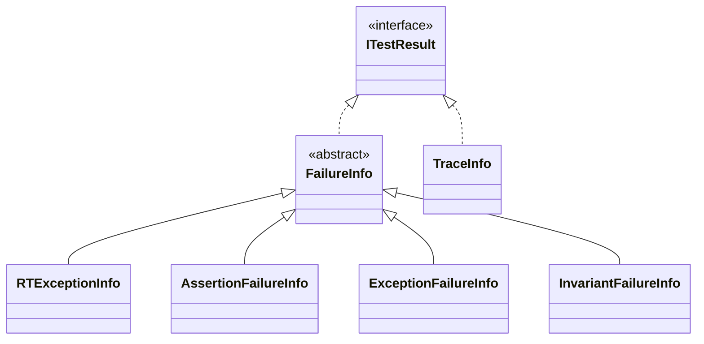

# interface ITestResult
```csharp
interface ITestResult
{
  string Caption {get;}
  IEnumerable<string> Report {get;}
  bool IsFailure {get;}
}
```
# class FailureInfo
```csharp
abstract class FailureInfo: ITestResult
{
  public string Caption { get; }
  public string? CallerName { get; init;}
  public string? SourceFilePath { get; init;}
  public int LineNumber { get; init;}
  public bool IsFailure { get;}
  public IEnumerable<string> Report {get;}
  
  //protected:
  protected FailureInfo(string caption);
  protected abstract IEnumerable<string> GetReport();
}
```
## Invariant
```csharp
Invariant
{
  IsFailure == true;
}
```
## FailureInfo(string)
```csharp
protected FailureInfo(string caption)
{
  require
  {
    !string.IsNullOrWhiteSpace(caption);
  }
  ensure
  {
    Caption == caption;

  }
}
```
# class RTExceptionInfo
```csharp
class RTExceptionInfo: FailureInfo
{
  public RTExceptionInfo(Exception ex);
  
  public Exception Exception {get;}
  
  //proetcted:
  protected override IEnumerable<string> GetReport();
}
```
## RTExceptionInfo(Exception)
```csharp
public RTExceptionInfo(Exception ex)
{
  require
  {
    ex != null; 
  }
  ensure
  {
    Exception == ex;
  }
}
```
# class AssertionFailureInfo
```csharp
class AssertionFailureInfo: FailureInfo
{
   public AssertionFailureInfo(string? exp);
   public string? Expression {get;}
   
  //proetcted:
  protected override IEnumerable<string> GetReport();
}
```
## AssertionFailureInfo(string?)
```csharp
public AssertionFailureInfo(string? exp)
{
  ensure
  {
    Expression == exp;
  }  
}
```
# class ExceptionFailureInfo
```csharp
class ExceptionFailureInfo :FailureInfo
{
  public ExceptionFailureInfo(Type? exWanted, Exception? exGot);
  public Exception? CatchedException {get;}
  public Type? ExpectedType {get;}
  public Type? CatchedType {get;}
  //protected:
  protected override IEnumerable<string> GetReport();
}
```
## ExceptionFailureInfo(Type?, Exception?)
```csharp
public ExceptionFailureInfo(Type? exWanted, Exception? exGot)
{
  require
  {
    !(exWanted == null && exGot == null);
    exWanted == null || exWanted.IsAssignableTo(typeof(Exception));
  }
  ensure
  {
    ExpectedType == exWanted;
    CatchedType == exGot?.GetType();
    CatchedException == exGot;
  }
}
```
# class InvariantFailureInfo
```csharp
class InvariantFailureInfo: FailureInfo
{
  public InvariantFailureInfo();
  public List<(string expression, int line)> Expressions {get;}
  //protected:
  protected override IEnumerable<string> GetReport();
}
```
## InvariantFailureInfo()
```csharp
public InvariantFailureInfo()
{
  ensure
  {
    Expressions.Count == 0;
  }
}
```
# class TraceInfo
```csharp
class TraceInfo : ITestResult
{
  public TraceInfo(string? msg);
  public string Caption { get; }
  bool IsFailure {get;}
  public IEnumerable<string> Report {get;}
  public void AddLine(string line);
}
```
## Invariant
```csharp
Invariant
{
  !IsFailure;
}
```
## TraceInfo(string?)
```csharp
public TraceInfo(string? msg)
{
  ensure
  {
    Caption != "" || string.IsNullOrWhiteSpace(msg); 
  }
}
```
## AddLine(string)
```csharp
public void AddLine(string line)
{
  require
  {
    line != null;
  }
}
```